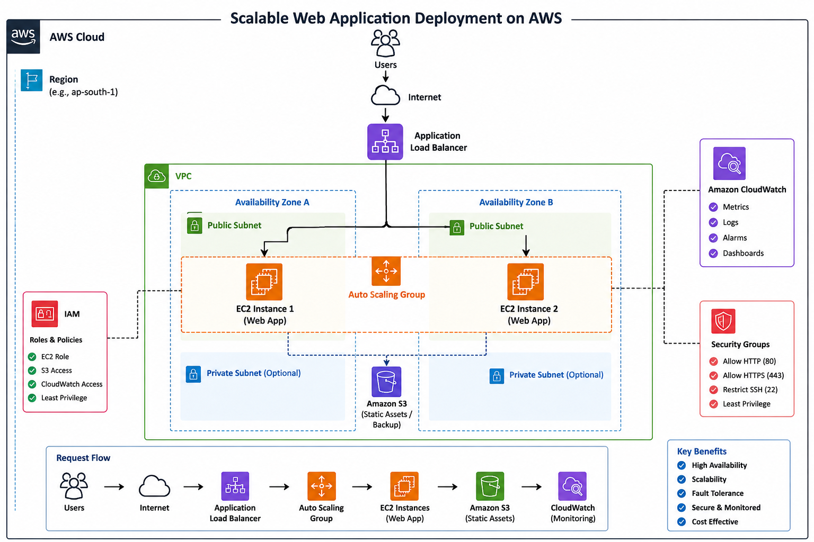

# AWS-Scalable-WebApp-Deployment
Scalable Web Application Deployment on AWS using EC2, Application Load Balancer, Auto Scaling, IAM, CloudWatch and S3.
## 🏗️ Architecture Diagram

  

## 📸 Screenshots
## 📸 Project Evidence

The AWS infrastructure was created and tested during project implementation. To avoid ongoing AWS charges, the cloud resources were decommissioned after successful validation.

This repository includes:

- Architecture diagram
- Deployment workflow
- Infrastructure documentation
- Setup scripts
- AWS services used

## Challenges Faced

- Configuring health checks for the Application Load Balancer.
- Understanding Auto Scaling Group capacity settings.
- Managing IAM permissions securely.
- Monitoring EC2 instances using Amazon CloudWatch.
## Future Improvements

- Automate infrastructure provisioning using Terraform.
- Implement CI/CD using GitHub Actions.
- Configure HTTPS using AWS Certificate Manager.
- Deploy across multiple Availability Zones.